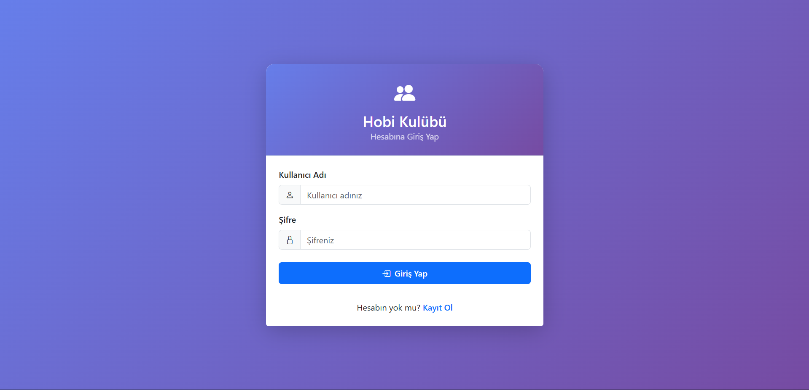
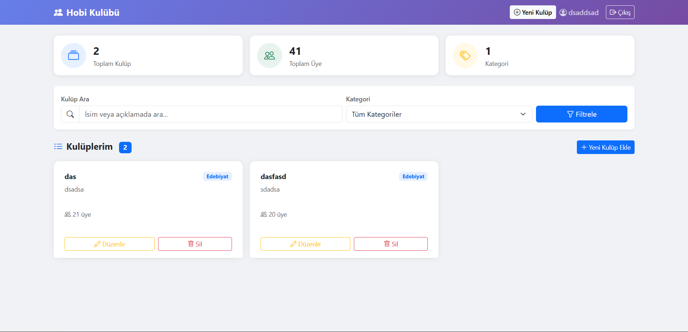

# 🎯 Hobi Kulübü Yönetim Sistemi

PHP, MySQL ve Bootstrap 5 ile geliştirilmiş web tabanlı bir hobi kulübü yönetim uygulaması.

---

## 📋 İçindekiler

- [Özellikler](#-özellikler)
- [Kullanılan Teknolojiler](#-kullanılan-teknolojiler)
- [Kurulum](#-kurulum)
- [Dosya Yapısı](#-dosya-yapısı)
- [Ekran Görüntüleri](#-ekran-görüntüleri)
- [Video Tanıtım](#-video-tanıtım)

---

## ✨ Özellikler

- 🔐 **Kullanıcı Kaydı & Girişi** — `password_hash()` ile güvenli şifre saklama, PHP Sessions ile oturum yönetimi
- ➕ **Kulüp Ekleme** — Ad, kategori, açıklama, kuruluş tarihi ve üye sayısı ile yeni kulüp kaydı
- 📋 **Kulüp Listeleme** — Kart görünümü, arama ve kategori filtresi, istatistik kartları
- ✏️ **Kulüp Düzenleme** — Mevcut kulüp bilgilerini güncelleme
- 🗑️ **Kulüp Silme** — Onay dialogu ile güvenli silme
- 🛡️ **Güvenlik** — XSS koruması, SQL Injection'a karşı PDO prepared statements, oturum sabitleme koruması

---

## 🛠 Kullanılan Teknolojiler

| Katman | Teknoloji |
|--------|-----------|
| Backend | PHP 8+ (yalın, framework yok) |
| Veritabanı | MySQL / MariaDB |
| Frontend | HTML5, Bootstrap 5.3, Bootstrap Icons |
| Veritabanı Erişimi | PDO (Prepared Statements) |
| Oturum Yönetimi | PHP Sessions |

---

## 🚀 Kurulum

### Gereksinimler
- PHP 8.0+
- MySQL 5.7+ veya MariaDB 10+
- Apache (XAMPP, WAMP veya hosting)

### Adımlar

**1. Projeyi İndir**
```bash
git clone https://github.com/m-YUSUF-d/Hobby-Club-Management-System.git
```

**2. Dosyaları Sunucuya Koy**

Yerel geliştirme için:
```
C:\xampp\htdocs\Hobby-Club-Management-System\
```

**3. Veritabanını Oluştur**

phpMyAdmin'i aç (`http://localhost/phpmyadmin`), yeni bir veritabanı oluştur ve `database.sql` dosyasını içe aktar.

Ya da MySQL konsolunda:
```bash
mysql -u root -p < database.sql
```

**4. `config.php` Dosyasını Düzenle**
```php
define('DB_HOST', 'localhost');
define('DB_NAME', 'hobi_kulubu');
define('DB_USER', 'root');      // Kendi kullanıcı adın
define('DB_PASS', '');          // Kendi şifren
```

**5. Uygulamayı Aç**
```
http://localhost/Hobby-Club-Management-System/
```

> ⚠️ **Canlıya alırken** `config.php` içindeki veritabanı bilgilerini hosting bilgilerinizle güncelleyin.

---

## 📁 Dosya Yapısı

```
Hobby Club Management System
│
├── config.php              # DB + session + helper fonksiyonlar
├── index.php               # giriş yönlendirme (login mi dashboard mu)
│
├── auth/                  # 🔐 kimlik doğrulama işlemleri
│   ├── login.php
│   ├── register.php
│   └── logout.php
│
├── clubs/                 # 🏢 uygulama ana modülü
│   ├── dashboard.php
│   ├── club_add.php
│   ├── club_edit.php
│   └── club_delete.php
│
└── database.sql           # veritabanı kurulum dosyası
```

---

## 🗄️ Veritabanı Yapısı

### `users` Tablosu
| Sütun | Tür | Açıklama |
|-------|-----|----------|
| id | INT (PK) | Otomatik artan ID |
| username | VARCHAR(50) | Benzersiz kullanıcı adı |
| email | VARCHAR(100) | Benzersiz e-posta |
| password | VARCHAR(255) | Hash'lenmiş şifre |
| created_at | DATETIME | Kayıt tarihi |

### `clubs` Tablosu
| Sütun | Tür | Açıklama |
|-------|-----|----------|
| id | INT (PK) | Otomatik artan ID |
| user_id | INT (FK) | Kullanıcı referansı |
| name | VARCHAR(100) | Kulüp adı |
| category | VARCHAR(50) | Kategori |
| description | TEXT | Açıklama |
| founded_date | DATE | Kuruluş tarihi |
| member_count | INT | Üye sayısı |
| created_at | DATETIME | Oluşturulma tarihi |
| updated_at | DATETIME | Son güncelleme tarihi |

---

## 📸 Ekran Görüntüleri

### Giriş Sayfası


### Dashboard


---

## 🎥 Video Tanıtım

📺 [Uygulama Tanıtım Videosu](https://youtu.be/6t6k1DZNtD4)


